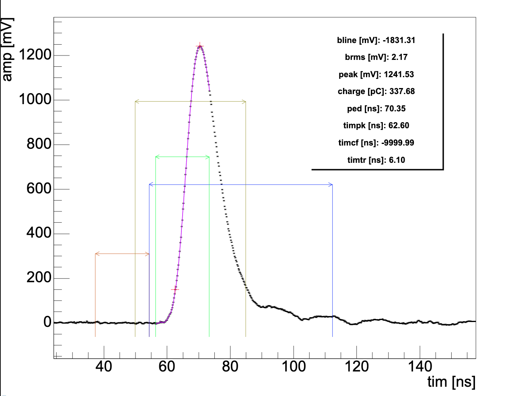
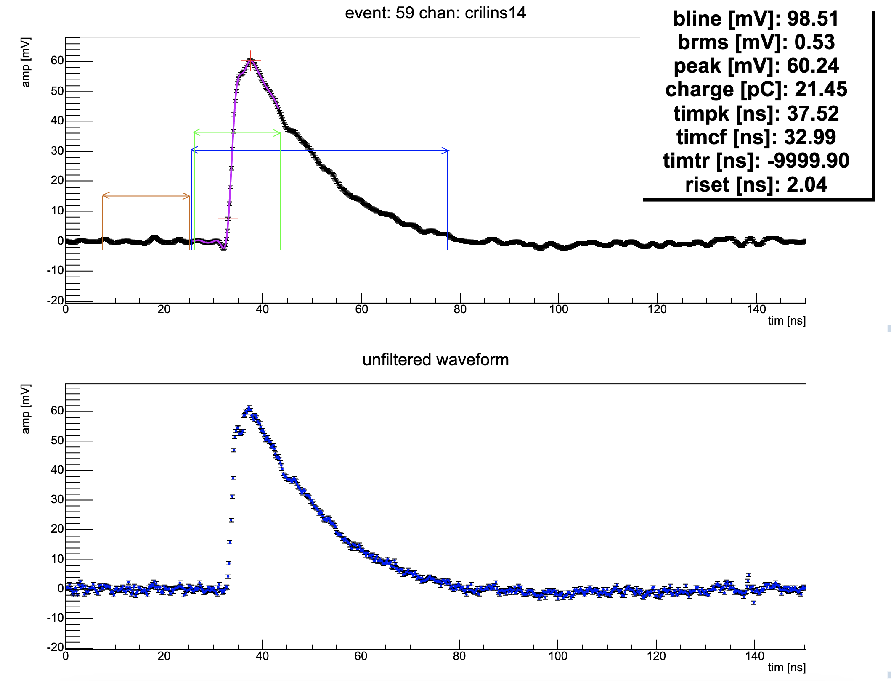

# UniversalPulseProcessor
 

Versatile waveform and pulse processing for digitisers.

- based on pyROOT, upROOT and scipy
- customisable digitiser objects with custom parameters (dynamic range, sampling frequency, etc)
- customisable wave blocks to handle different detectors (calorimeters, scintillators, digital signals, etc)
- default reconstruction: peak, charge, bline, blinerms, risetime, timing constant fraction, timing template fit, peak time, threshold time
- configurable peak finder and processing gates
- FFT support
- wave ok parameter based on user defined cuts
- configurable threshold and constant fraction timing scans for optimisation
- configurable digital filters based on scipy.signal
- support for parallelisation using HTCondor

